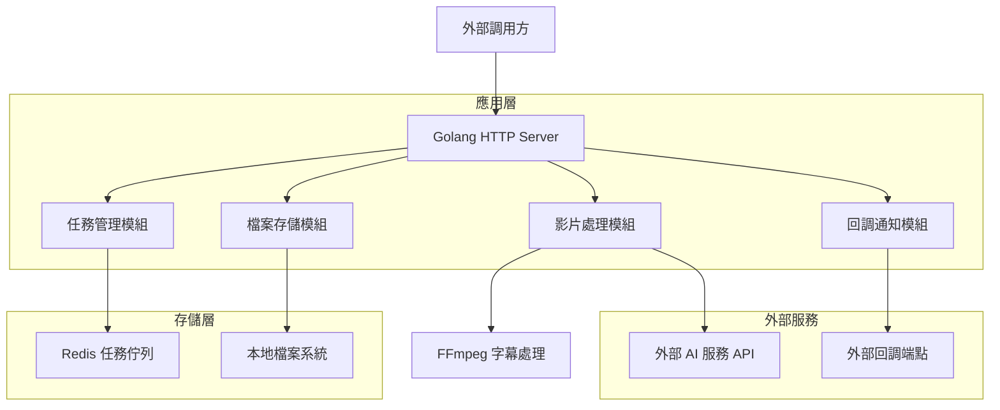
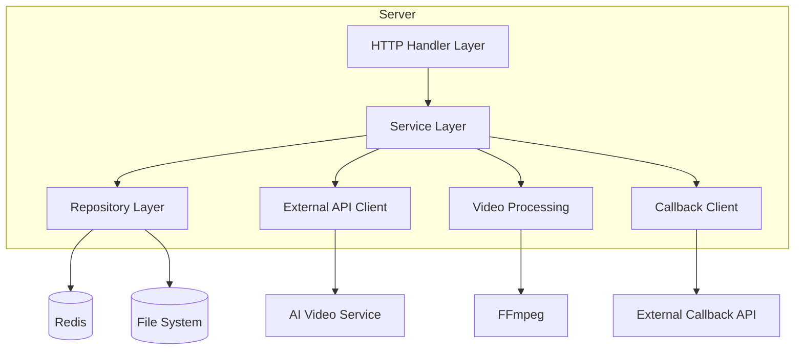
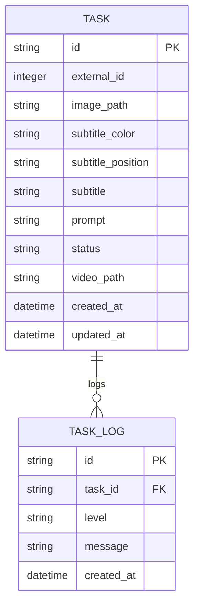

# AI 影片生成服務 - 技術架構文檔

## 1. Architecture design



## 2. Technology Description

* Frontend: 無（純後端 API 服務）

* Backend: Go\@1.21 + Gin\@1.9 + Redis\@7.0

* 影片處理: FFmpeg

* HTTP Client: Go 標準庫 net/http

* 任務佇列: Redis

* 日誌: logrus

## 3. Route definitions

| Route                         | Purpose    |
| ----------------------------- | ---------- |
| POST /api/v1/generate-video   | 接收影片生成任務請求 |
| GET /api/v1/tasks/{id}/status | 查詢任務執行狀態   |
| GET /health                   | 服務健康檢查端點   |
| GET /metrics                  | 服務監控指標端點   |

## 4. API definitions

### 4.1 Core API

#### 影片生成任務

```
POST /api/v1/generate-video
```

Request:

| Param Name         | Param Type | isRequired | Description                       |
| ------------------ | ---------- | ---------- | --------------------------------- |
| id                 | integer    | true       | 任務唯一識別碼                           |
| image\_path        | string     | true       | 圖片檔案的 URL 路徑                      |
| subtitle\_color    | string     | true       | 字幕顏色（如 "white", "black"）          |
| subtitle\_position | string     | true       | 字幕位置（如 "bottom", "top", "center"） |
| subtitle           | string     | true       | 字幕內容文字                            |
| prompt             | string     | true       | AI 影片生成的提示詞                       |

Response:

| Param Name   | Param Type | Description                                          |
| ------------ | ---------- | ---------------------------------------------------- |
| status       | string     | 任務狀態（"pending", "processing", "completed", "failed"） |
| external\_id | string     | 內部生成的任務 ID                                           |
| message      | string     | 狀態描述訊息                                               |

Example Request:

```json
{
  "id": 1,
  "image_path": "http://your-domain.com/storage/video-task-images/image1.jpg",
  "subtitle_color": "white",
  "subtitle_position": "bottom",
  "subtitle": "歡迎來到我們的平台",
  "prompt": "創建一個專業的介紹影片，包含動畫效果"
}
```

Example Response:

```json
{
  "status": "pending",
  "external_id": "task_1704067200_abc123",
  "message": "任務已接收，正在處理中"
}
```

#### 任務狀態查詢

```
GET /api/v1/tasks/{id}/status
```

Response:

| Param Name  | Param Type | Description |
| ----------- | ---------- | ----------- |
| task\_id    | string     | 任務 ID       |
| status      | string     | 當前狀態        |
| progress    | integer    | 處理進度百分比     |
| created\_at | string     | 任務創建時間      |
| updated\_at | string     | 最後更新時間      |

#### 影片上傳回調（調用外部 API）

```
POST /video-tasks/{id}/completed
```

Request (Form Data):

| Param Name         | Param Type | isRequired | Description                        |
| ------------------ | ---------- | ---------- | ---------------------------------- |
| video\_file        | file       | true       | 完成的影片檔案（mp4/mpeg/quicktime，≤100MB） |
| external\_task\_id | string     | false      | 外部任務 ID                            |

## 5. Server architecture diagram



## 6. Data model

### 6.1 Data model definition



### 6.2 Data Definition Language

由於使用 Redis 作為主要存儲，數據結構以 JSON 格式存儲：

#### 任務資料結構 (Redis Hash)

```go
// Redis Key: task:{task_id}
type Task struct {
    ID              string    `json:"id"`
    ExternalID      int       `json:"external_id"`
    ImagePath       string    `json:"image_path"`
    SubtitleColor   string    `json:"subtitle_color"`
    SubtitlePosition string   `json:"subtitle_position"`
    Subtitle        string    `json:"subtitle"`
    Prompt          string    `json:"prompt"`
    Status          string    `json:"status"` // pending, processing, completed, failed
    VideoPath       string    `json:"video_path,omitempty"`
    ErrorMessage    string    `json:"error_message,omitempty"`
    CreatedAt       time.Time `json:"created_at"`
    UpdatedAt       time.Time `json:"updated_at"`
}
```

#### 任務佇列結構 (Redis List)

```go
// Redis Key: task_queue
// 存儲待處理的任務 ID 列表
// LPUSH task_queue {task_id}
// RPOP task_queue -> {task_id}
```

#### 任務狀態索引 (Redis Set)

```go
// Redis Key: tasks_by_status:{status}
// 按狀態分組的任務 ID 集合
// SADD tasks_by_status:pending {task_id}
// SMEMBERS tasks_by_status:completed
```

#### 初始化配置

```go
// 服務啟動時的 Redis 配置
const (
    TaskKeyPrefix = "task:"
    TaskQueueKey = "task_queue"
    TaskStatusPrefix = "tasks_by_status:"
    TaskTTL = 24 * time.Hour // 任務資料保留 24 小時
)

// 狀態常數
const (
    StatusPending    = "pending"
    StatusProcessing = "processing"
    StatusCompleted  = "completed"
    StatusFailed     = "failed"
)
```

