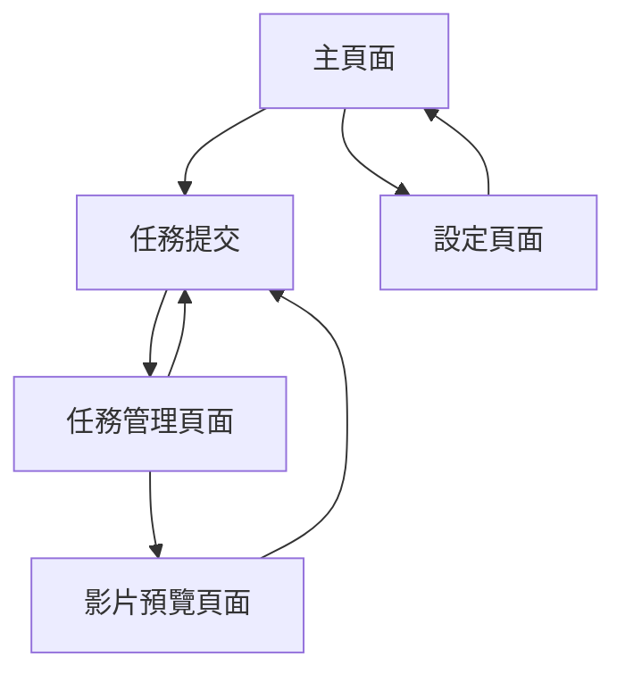

# AI影片生成服務測試前端 - 產品需求文檔

## 1. Product Overview

本產品是 AI 影片生成服務的測試前端介面，提供直觀的 Web 界面來測試和管理影片生成任務。
支持模擬模式和正式模式切換，讓開發者能夠在不同環境下測試服務功能，確保系統穩定性和可靠性。
目標是為開發團隊提供一個完整的測試工具，加速開發流程並提升產品品質。

## 2. Core Features

### 2.1 User Roles

| Role | Registration Method | Core Permissions |
|------|---------------------|------------------|
| 開發者 | 無需註冊，直接使用 | 可提交任務、切換模式、查看所有功能 |
| 測試人員 | 無需註冊，直接使用 | 可提交任務、查看任務狀態、使用基本功能 |

### 2.2 Feature Module

我們的測試前端包含以下主要頁面：

1. **主頁面**：任務提交表單、模式切換開關、即時狀態顯示
2. **任務管理頁面**：任務列表、狀態篩選、詳細資訊查看
3. **設定頁面**：系統配置、模式參數設定、服務端點配置
4. **影片預覽頁面**：生成結果預覽、下載功能、品質檢查

### 2.3 Page Details

| Page Name | Module Name | Feature description |
|-----------|-------------|---------------------|
| 主頁面 | 任務提交表單 | 上傳圖片、輸入提示詞、設定字幕顏色和位置、提交任務 |
| 主頁面 | 模式切換開關 | 在模擬模式和正式模式間切換、顯示當前模式狀態 |
| 主頁面 | 即時狀態顯示 | 顯示任務進度、處理狀態、錯誤訊息、完成通知 |
| 任務管理頁面 | 任務列表 | 顯示所有任務、分頁瀏覽、狀態篩選、搜尋功能 |
| 任務管理頁面 | 任務詳情 | 查看任務參數、處理日誌、錯誤詳情、重新提交 |
| 設定頁面 | 模式配置 | 切換運行模式、設定 AI 服務端點、配置模擬影片路徑 |
| 設定頁面 | 系統參數 | 設定超時時間、重試次數、回調端點、日誌級別 |
| 影片預覽頁面 | 影片播放器 | 播放生成影片、字幕顯示、品質調整、全螢幕模式 |
| 影片預覽頁面 | 下載管理 | 下載影片檔案、批量下載、格式選擇、壓縮選項 |

## 3. Core Process

### 開發者測試流程

1. 開發者進入主頁面，選擇測試模式（模擬或正式）
2. 填寫任務表單：上傳圖片、輸入提示詞、設定字幕參數
3. 提交任務後，系統顯示任務 ID 和即時狀態
4. 在任務管理頁面追蹤任務進度和查看詳細資訊
5. 任務完成後，在影片預覽頁面查看結果並下載
6. 根據測試結果調整設定或重新提交任務

### 模式切換流程

1. 在主頁面或設定頁面點擊模式切換開關
2. 選擇目標模式（模擬模式使用預設影片，正式模式調用 AI 服務）
3. 系統更新配置並顯示切換成功訊息
4. 後續任務將按照新模式執行

## 4. User Interface Design

### 4.1 Design Style

- **主色調**：藍色系 (#3B82F6) 和灰色系 (#6B7280)
- **輔助色**：綠色 (#10B981) 表示成功，紅色 (#EF4444) 表示錯誤，橙色 (#F59E0B) 表示警告
- **按鈕風格**：圓角按鈕，具有 hover 效果和點擊反饋
- **字體**：Inter 字體，標題 18-24px，正文 14-16px，小字 12px
- **佈局風格**：卡片式設計，響應式佈局，左側導航欄
- **圖標風格**：使用 Heroicons 或 Lucide 圖標庫，簡潔現代風格

### 4.2 Page Design Overview

| Page Name | Module Name | UI Elements |
|-----------|-------------|-------------|
| 主頁面 | 任務提交表單 | 白色卡片容器，檔案上傳區域（虛線邊框），輸入框（圓角邊框），下拉選單（自定義樣式），提交按鈕（藍色漸層） |
| 主頁面 | 模式切換開關 | Toggle 開關（藍色/灰色），模式標籤，狀態指示燈（綠色/紅色圓點） |
| 主頁面 | 狀態顯示區 | 進度條（藍色漸層），狀態標籤（彩色徽章），通知卡片（帶圖標） |
| 任務管理頁面 | 任務列表 | 表格佈局，斑馬紋背景，狀態徽章，操作按鈕組，分頁控制項 |
| 設定頁面 | 配置表單 | 分組表單，標籤對齊，輸入驗證提示，保存按鈕（綠色） |
| 影片預覽頁面 | 影片播放器 | 自定義播放控制項，字幕開關，品質選擇器，全螢幕按鈕 |

### 4.3 Responsiveness

採用移動優先的響應式設計，支援桌面端（1200px+）、平板端（768px-1199px）和手機端（<768px）。
在手機端將左側導航欄收合為漢堡選單，表格改為卡片式佈局，按鈕和輸入框適配觸控操作。