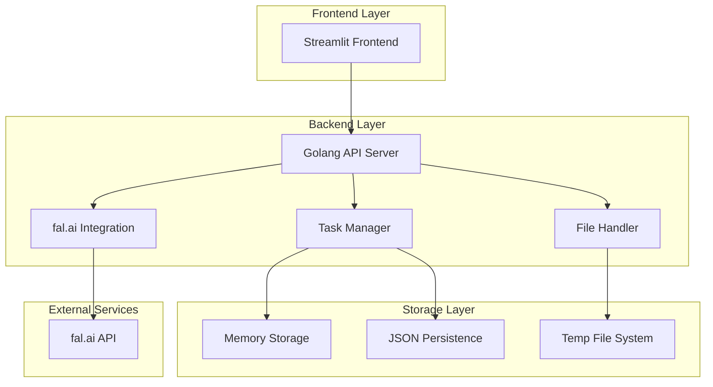
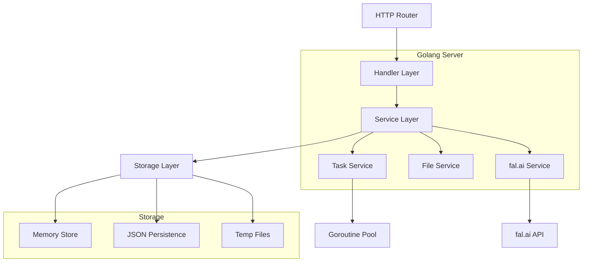
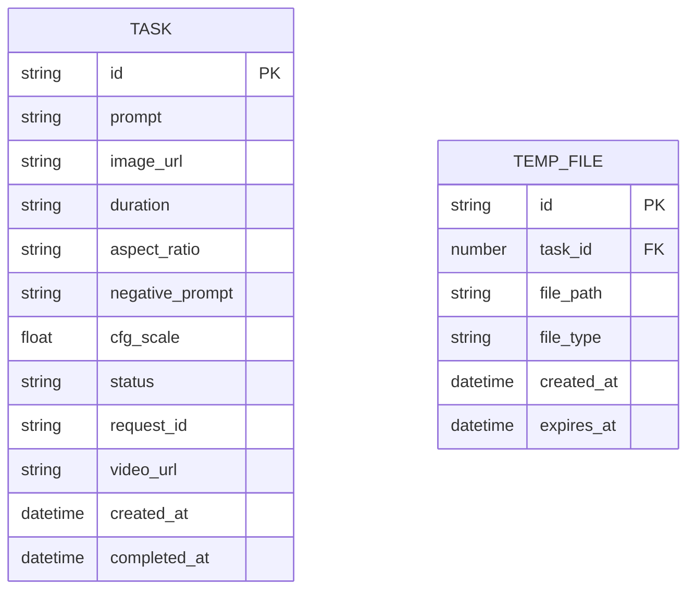

# genVideo&Sub 技術架構文檔

## 1. Architecture design



## 2. Technology Description

- Frontend: Streamlit（測試界面）
- Backend: Golang@1.21 + Gin Framework
- File Processing: 內建文件處理
- Storage: 內存存儲 + JSON文件持久化
- AI Integration: fal.ai Kling Video v1.6 Pro API
- Task Management: Goroutine Pool + Channel Queue

## 3. Route definitions

| Route | Purpose |
|-------|---------|  
| POST /api/tasks | 創建視頻生成任務 |
| GET /api/tasks/:id/status | 查詢任務狀態 |
| GET /api/tasks/:id/result | 獲取任務結果 |
| GET /api/tasks | 獲取任務列表 |
| DELETE /api/tasks/:id | 刪除任務 |
| GET /api/health | 健康檢查 |
| GET /api/metrics | 系統指標 |

## 4. fal.ai API Integration

### 4.1 認證配置

fal.ai API 使用 API Key 進行認證，建議設置環境變數：
```bash
export FAL_KEY="your-fal-api-key"
```

### 4.2 異步處理流程

1. **提交請求**: 使用 `fal.queue.submit()` 提交任務到 fal.ai
2. **狀態查詢**: 使用 `fal.queue.status()` 查詢任務進度
3. **獲取結果**: 使用 `fal.queue.result()` 獲取完成的視頻

### 4.3 文件處理

fal.ai 支持多種文件輸入方式：
1. **公開URL**: 直接使用可公開訪問的圖片URL
2. **Base64編碼**: 將圖片編碼為Base64格式
3. **文件上傳**: 使用 fal.storage.upload() 上傳文件

文件上傳示例:
```go
// 上傳文件到 fal.ai 存儲
fileURL, err := falClient.UploadFile(imageFile)
if err != nil {
    return err
}
```

### 4.4 錯誤處理

- **重試機制**: 網絡錯誤自動重試，最多3次
- **超時處理**: 請求超時時間設為300秒
- **狀態監控**: 定期檢查任務狀態，避免無限等待

### 4.5 API 調用示例

提交任務:
```go
request := map[string]interface{}{
    "input": map[string]interface{}{
        "prompt": "Snowflakes fall as a car moves along the road.",
        "image_url": "https://example.com/image.jpg",
        "duration": "5",
        "aspect_ratio": "16:9",
        "negative_prompt": "blur, distort, and low quality",
        "cfg_scale": 0.5,
    },
}
```

響應格式:
```json
{
    "request_id": "764cabcf-b745-4b3e-ae38-1200304cf45b"
}
```

結果格式:
```json
{
    "video": {
        "url": "https://storage.googleapis.com/falserverless/kling/output.mp4"
    }
}
```

## 5. API definitions

### 5.1 Core API

創建視頻生成任務
```
POST /api/tasks
```

Request:
| Param Name | Param Type | isRequired | Description |
|------------|------------|------------|-------------|
| prompt | string | true | AI生成提示詞 |
| image_url | string | true | 圖片URL路徑 |
| duration | string | false | 視頻時長 ("5" 或 "10", 默認 "5") |
| aspect_ratio | string | false | 視頻比例 ("16:9", "9:16", "1:1", 默認 "16:9") |
| negative_prompt | string | false | 負面提示詞 (默認 "blur, distort, and low quality") |
| cfg_scale | float | false | CFG引導強度 (默認 0.5) |

Response:
| Param Name | Param Type | Description |
|------------|------------|-------------|
| status | string | 任務狀態 (pending/processing/completed/failed) |
| request_id | string | fal.ai 請求ID |
| task_id | string | 內部任務ID |

查詢任務狀態
```
GET /api/tasks/:id/status
```

Response:
| Param Name | Param Type | Description |
|------------|------------|-------------|
| id | number | 任務ID |
| status | string | 任務狀態 |
| external_id | string | 外部任務ID |
| created_at | string | 創建時間 |
| completed_at | string | 完成時間 |

獲取任務結果
```
GET /api/tasks/:id/result
```

Response:
| Param Name | Param Type | Description |
|------------|------------|-------------|
| success | boolean | 獲取狀態 |
| video_url | string | 生成的視頻URL |
| request_id | string | fal.ai 請求ID |
| status | string | 任務狀態 |

## 6. Server architecture diagram



## 7. Data model

### 7.1 Data model definition



### 7.2 Data Storage Format

任務數據存儲 (data/tasks.json)
```json
{
  "tasks": {
    "task_001": {
      "id": "task_001",
      "prompt": "Snowflakes fall as a car moves along the road.",
      "image_url": "https://storage.googleapis.com/falserverless/kling/kling_input.jpeg",
      "duration": "5",
      "aspect_ratio": "16:9",
      "negative_prompt": "blur, distort, and low quality",
      "cfg_scale": 0.5,
      "status": "pending",
      "request_id": "764cabcf-b745-4b3e-ae38-1200304cf45b",
      "video_url": "",
      "created_at": "2024-01-15T10:30:00Z",
      "completed_at": null
    }
  },
  "metadata": {
    "last_task_id": "task_001",
    "total_tasks": 1,
    "updated_at": "2024-01-15T10:30:00Z"
  }
}
```

臨時文件記錄 (data/temp_files.json)
```json
{
  "files": {
    "temp_001": {
      "id": "temp_001",
      "task_id": 1,
      "file_path": "temp/downloads/image1.jpg",
      "file_type": "image",
      "created_at": "2024-01-15T10:30:00Z",
      "expires_at": "2024-01-15T11:30:00Z"
    }
  }
}
```

系統配置 (config/app.json)
```json
{
  "server": {
    "port": 8080,
    "host": "localhost"
  },
  "fal_ai": {
    "api_key": "your-fal-key",
    "model_endpoint": "fal-ai/kling-video/v1.6/pro/image-to-video",
    "timeout": 300,
    "max_retries": 3
  },
  "storage": {
    "temp_dir": "temp",
    "data_dir": "data",
    "max_file_size": 104857600,
    "cleanup_interval": 3600
  },
  "worker": {
    "max_workers": 5,
    "queue_size": 100
  }
}
```