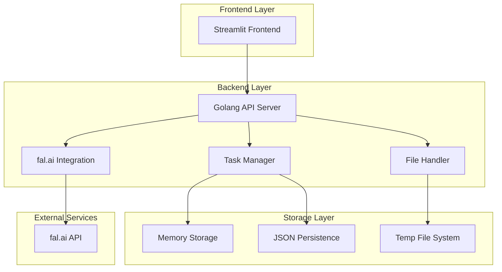
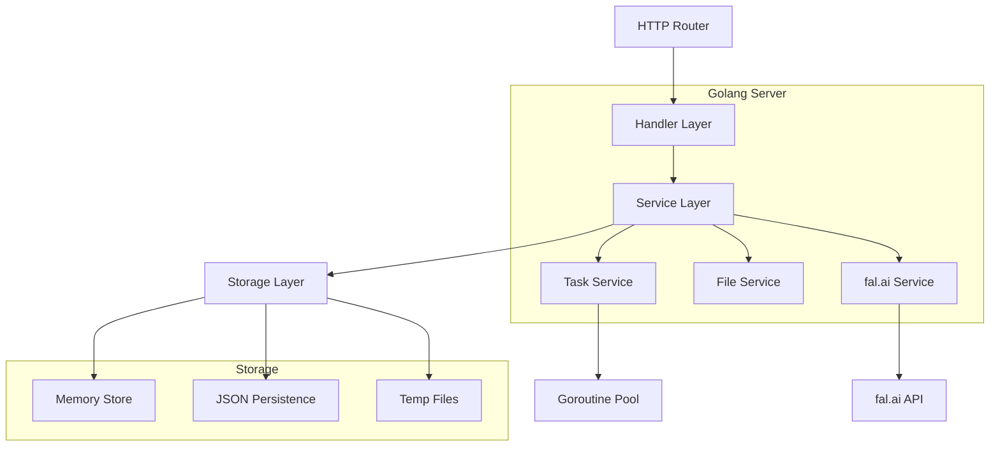
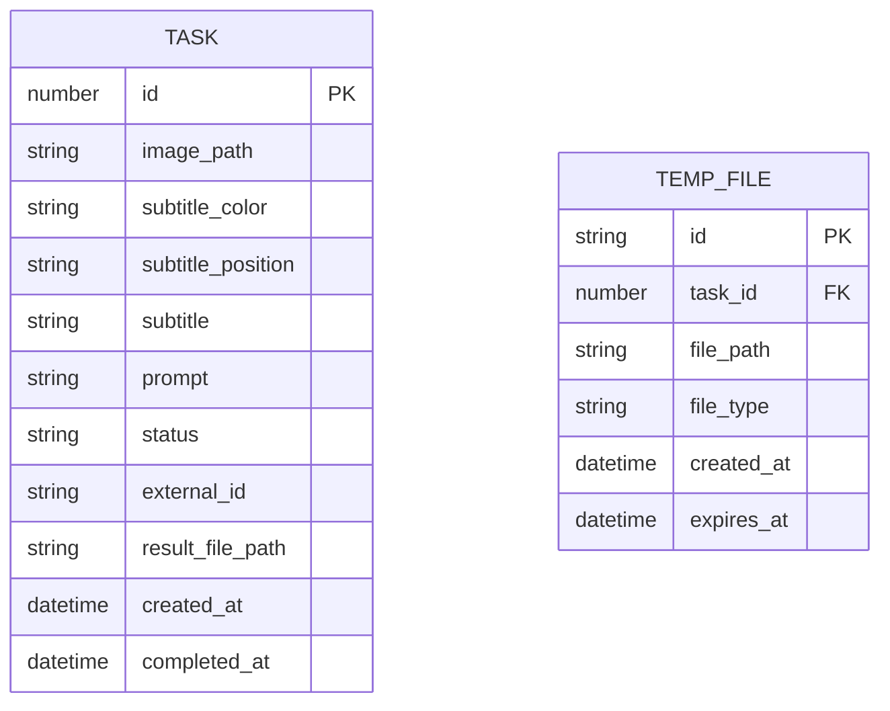

# genVideo&Sub 技術架構文檔

## 1. Architecture design



## 2. Technology Description

- Frontend: Streamlit（測試界面）
- Backend: Golang@1.21 + Gin Framework
- File Processing: 內建文件處理
- Storage: 內存存儲 + JSON文件持久化
- AI Integration: fal.ai API
- Task Management: Goroutine Pool + Channel Queue

## 3. Route definitions

| Route | Purpose |
|-------|---------|
| POST /api/tasks | 創建視頻生成任務 |
| GET /api/tasks/:id/status | 查詢任務狀態 |
| POST /api/tasks/:id/completed | 上傳完成的影片 |
| GET /api/tasks | 獲取任務列表 |
| DELETE /api/tasks/:id | 刪除任務 |
| GET /api/health | 健康檢查 |
| GET /api/metrics | 系統指標 |

## 4. API definitions

### 4.1 Core API

創建視頻生成任務
```
POST /api/tasks
```

Request:
| Param Name | Param Type | isRequired | Description |
|------------|------------|------------|-------------|
| id | number | true | 任務ID |
| image_path | string | true | 圖片URL路徑 |
| subtitle_color | string | true | 字幕顏色 |
| subtitle_position | string | true | 字幕位置 |
| subtitle | string | true | 字幕內容 |
| prompt | string | true | AI生成提示詞 |

Response:
| Param Name | Param Type | Description |
|------------|------------|-------------|
| status | string | 任務狀態 (pending/processing/completed/failed) |
| external_id | string | 外部AI服務任務ID |

查詢任務狀態
```
GET /api/tasks/:id/status
```

Response:
| Param Name | Param Type | Description |
|------------|------------|-------------|
| id | number | 任務ID |
| status | string | 任務狀態 |
| external_id | string | 外部任務ID |
| created_at | string | 創建時間 |
| completed_at | string | 完成時間 |

上傳完成影片
```
POST /api/tasks/:id/completed
```

Request (Form Data):
| Param Name | Param Type | isRequired | Description |
|------------|------------|------------|-------------|
| video_file | file | true | 影片文件 (最大100MB) |
| external_task_id | string | false | 外部任務ID |

Response:
| Param Name | Param Type | Description |
|------------|------------|-------------|
| success | boolean | 上傳狀態 |
| message | string | 狀態訊息 |
| data | object | 包含file_path和task_id |

## 5. Server architecture diagram



## 6. Data model

### 6.1 Data model definition



### 6.2 Data Storage Format

任務數據存儲 (data/tasks.json)
```json
{
  "tasks": {
    "1": {
      "id": 1,
      "image_path": "http://example.com/image1.jpg",
      "subtitle_color": "white",
      "subtitle_position": "bottom",
      "subtitle": "歡迎來到我們的平台",
      "prompt": "創建一個專業的介紹影片",
      "status": "pending",
      "external_id": "ai_12312444_213321",
      "result_file_path": "",
      "created_at": "2024-01-15T10:30:00Z",
      "completed_at": null
    }
  },
  "metadata": {
    "last_task_id": 1,
    "total_tasks": 1,
    "updated_at": "2024-01-15T10:30:00Z"
  }
}
```

臨時文件記錄 (data/temp_files.json)
```json
{
  "files": {
    "temp_001": {
      "id": "temp_001",
      "task_id": 1,
      "file_path": "temp/downloads/image1.jpg",
      "file_type": "image",
      "created_at": "2024-01-15T10:30:00Z",
      "expires_at": "2024-01-15T11:30:00Z"
    }
  }
}
```

系統配置 (config/app.json)
```json
{
  "server": {
    "port": 8080,
    "host": "localhost"
  },
  "fal_ai": {
    "api_key": "your-api-key",
    "base_url": "https://fal.run/fal-ai",
    "timeout": 300
  },
  "storage": {
    "temp_dir": "temp",
    "data_dir": "data",
    "max_file_size": 104857600,
    "cleanup_interval": 3600
  },
  "worker": {
    "max_workers": 5,
    "queue_size": 100
  }
}
```