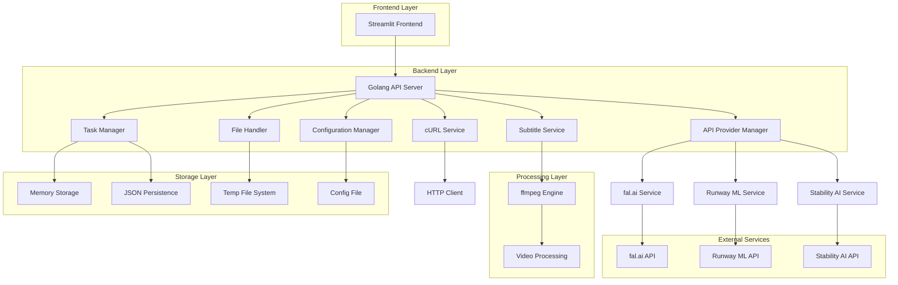
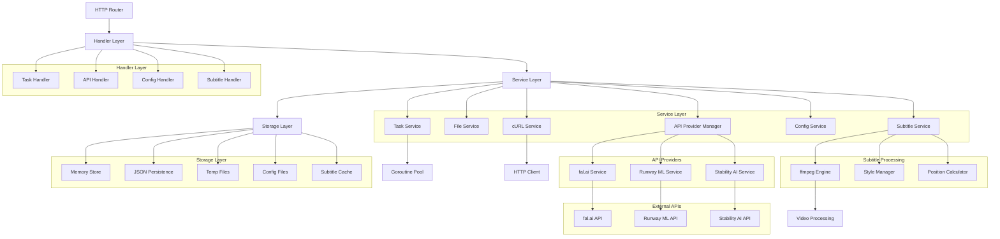
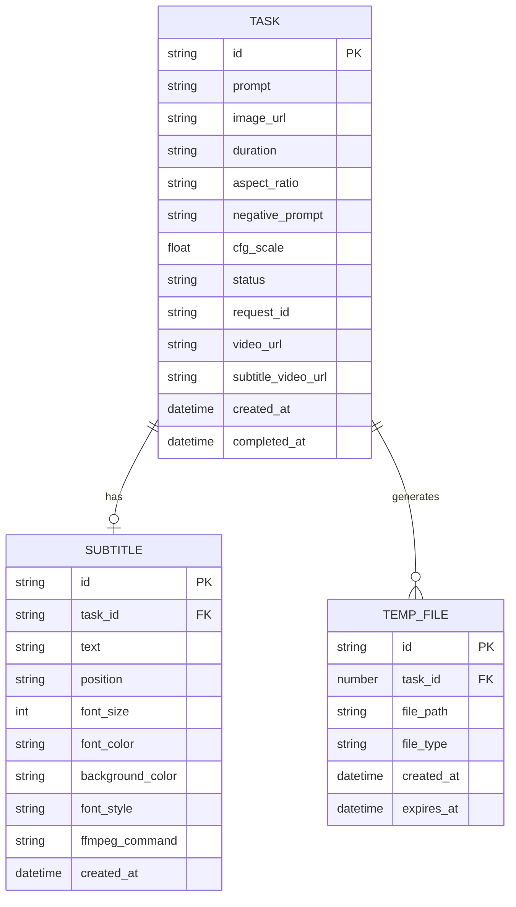

# genVideo\&Sub 技術架構文檔

## 1. Architecture design

### 1.1 整體架構 (Production Mode)



### 1.2 運行模式

系統支援兩種運行模式：

1. **Mock Mode**: 用於開發和測試，使用模擬數據
2. **Production Mode**: 正式環境，連接真實的API服務

模式切換通過配置文件 `config.json` 中的 `mode` 字段控制。

## 2. Technology Description

### 2.1 核心技術棧

* **Frontend**: Streamlit（測試界面）

* **Backend**: Golang\@1.21 + Gin Framework

* **File Processing**: 內建文件處理 + 多格式支援

* **Storage**: 內存存儲 + JSON文件持久化

* **Task Management**: Goroutine Pool + Channel Queue

* **HTTP Client**: 內建HTTP客戶端 + 重試機制

* **Configuration**: JSON配置文件 + 動態重載

### 2.2 AI服務集成

* **fal.ai**: Kling Video v1.6 Pro API（預設）

* **Runway ML**: 視頻生成API

* **Stability AI**: 視頻生成API

* **API Provider Manager**: 統一的API提供商管理

* **Dynamic Switching**: 運行時切換API提供商

### 2.3 新增功能

* **Production Mode**: 正式環境運行模式

* **cURL Integration**: cURL命令生成、解析和執行

* **Multi-Provider Support**: 多API提供商支援

* **Configuration Management**: 動態配置管理

* **Subtitle Processing**: ffmpeg字幕處理和渲染

* **Comprehensive Testing**: 完整的測試套件

## 3. Route definitions

### 3.1 核心任務API

| Route                    | Method | Purpose  |
| ------------------------ | ------ | -------- |
| /api/v1/tasks            | POST   | 創建視頻生成任務 |
| /api/v1/tasks/:id/status | GET    | 查詢任務狀態   |
| /api/v1/tasks/:id/result | GET    | 獲取任務結果   |
| /api/v1/tasks            | GET    | 獲取任務列表   |
| /api/v1/tasks/:id        | DELETE | 刪除任務     |

### 3.2 API提供商管理

| Route                     | Method | Purpose      |
| ------------------------- | ------ | ------------ |
| /api/v1/providers         | GET    | 獲取所有API提供商信息 |
| /api/v1/providers/switch  | POST   | 切換API提供商     |
| /api/v1/providers/current | GET    | 獲取當前API提供商   |

### 3.3 配置管理

| Route                   | Method | Purpose |
| ----------------------- | ------ | ------- |
| /api/v1/config          | GET    | 獲取當前配置  |
| /api/v1/config          | PUT    | 更新配置    |
| /api/v1/config/validate | POST   | 驗證配置    |

### 3.4 cURL功能

| Route                 | Method | Purpose  |
| --------------------- | ------ | -------- |
| /api/v1/curl/execute  | POST   | 執行cURL請求 |
| /api/v1/curl/generate | POST   | 生成cURL命令 |
| /api/v1/curl/parse    | POST   | 解析cURL命令 |

### 3.5 字幕處理API

| Route                     | Method | Purpose  |
| ------------------------- | ------ | -------- |
| /api/v1/subtitles/add     | POST   | 為視頻添加字幕  |
| /api/v1/subtitles/preview | POST   | 預覽字幕效果   |
| /api/v1/subtitles/styles  | GET    | 獲取可用字幕樣式 |

### 3.6 系統監控

| Route           | Method | Purpose |
| --------------- | ------ | ------- |
| /api/v1/health  | GET    | 健康檢查    |
| /api/v1/metrics | GET    | 系統指標    |
| /api/v1/status  | GET    | 服務狀態    |

## 4. fal.ai API Integration

### 4.1 認證配置

fal.ai API 使用 API Key 進行認證，建議設置環境變數：

```bash
export FAL_KEY="your-fal-api-key"
```

### 4.2 異步處理流程

1. **提交請求**: 使用 `fal.queue.submit()` 提交任務到 fal.ai
2. **狀態查詢**: 使用 `fal.queue.status()` 查詢任務進度
3. **獲取結果**: 使用 `fal.queue.result()` 獲取完成的視頻

### 4.3 文件處理

fal.ai 支持多種文件輸入方式：

1. **公開URL**: 直接使用可公開訪問的圖片URL
2. **Base64編碼**: 將圖片編碼為Base64格式
3. **文件上傳**: 使用 fal.storage.upload() 上傳文件

文件上傳示例:

```go
// 上傳文件到 fal.ai 存儲
fileURL, err := falClient.UploadFile(imageFile)
if err != nil {
    return err
}
```

### 4.4 錯誤處理

* **重試機制**: 網絡錯誤自動重試，最多3次

* **超時處理**: 請求超時時間設為300秒

* **狀態監控**: 定期檢查任務狀態，避免無限等待

### 4.5 API 調用示例

提交任務:

```go
request := map[string]interface{}{
    "input": map[string]interface{}{
        "prompt": "Snowflakes fall as a car moves along the road.",
        "image_url": "https://example.com/image.jpg",
        "duration": "5",
        "aspect_ratio": "16:9",
        "negative_prompt": "blur, distort, and low quality",
        "cfg_scale": 0.5,
    },
}
```

響應格式:

```json
{
    "request_id": "764cabcf-b745-4b3e-ae38-1200304cf45b"
}
```

結果格式:

```json
{
    "video": {
        "url": "https://storage.googleapis.com/falserverless/kling/output.mp4"
    }
}
```

## 5. API definitions

### 5.1 任務管理API

#### 創建視頻生成任務

```
POST /api/v1/tasks
```

Request:

| Param Name       | Param Type | isRequired | Description                                         |
| ---------------- | ---------- | ---------- | --------------------------------------------------- |
| prompt           | string     | true       | AI生成提示詞                                             |
| image\_url       | string     | true       | 圖片URL路徑                                             |
| duration         | string     | false      | 視頻時長 ("5" 或 "10", 默認 "5")                           |
| aspect\_ratio    | string     | false      | 視頻比例 ("16:9", "9:16", "1:1", 默認 "16:9")             |
| negative\_prompt | string     | false      | 負面提示詞 (默認 "blur, distort, and low quality")         |
| cfg\_scale       | float      | false      | CFG引導強度 (默認 0.5)                                    |
| provider         | string     | false      | 指定API提供商 ("fal\_ai", "runway\_ml", "stability\_ai") |

Response:

| Param Name  | Param Type | Description                                |
| ----------- | ---------- | ------------------------------------------ |
| status      | string     | 任務狀態 (pending/processing/completed/failed) |
| request\_id | string     | 外部API請求ID                                  |
| task\_id    | string     | 內部任務ID                                     |
| provider    | string     | 使用的API提供商                                  |

#### 查詢任務狀態

```
GET /api/v1/tasks/:id/status
```

Response:

| Param Name    | Param Type | Description |
| ------------- | ---------- | ----------- |
| id            | string     | 任務ID        |
| status        | string     | 任務狀態        |
| external\_id  | string     | 外部任務ID      |
| provider      | string     | API提供商      |
| created\_at   | string     | 創建時間        |
| completed\_at | string     | 完成時間        |

#### 獲取任務結果

```
GET /api/v1/tasks/:id/result
```

Response:

| Param Name  | Param Type | Description |
| ----------- | ---------- | ----------- |
| success     | boolean    | 獲取狀態        |
| video\_url  | string     | 生成的視頻URL    |
| request\_id | string     | 外部API請求ID   |
| status      | string     | 任務狀態        |
| provider    | string     | API提供商      |

### 5.2 API提供商管理

#### 獲取所有提供商

```
GET /api/v1/providers
```

Response:

| Param Name | Param Type | Description |
| ---------- | ---------- | ----------- |
| providers  | array      | 提供商列表       |
| current    | string     | 當前提供商       |

#### 切換API提供商

```
POST /api/v1/providers/switch
```

Request:

| Param Name | Param Type | isRequired | Description |
| ---------- | ---------- | ---------- | ----------- |
| provider   | string     | true       | 目標提供商名稱     |

Response:

| Param Name | Param Type | Description |
| ---------- | ---------- | ----------- |
| success    | boolean    | 切換狀態        |
| previous   | string     | 之前的提供商      |
| current    | string     | 當前提供商       |

### 5.3 配置管理API

#### 獲取配置

```
GET /api/v1/config
```

Response:

| Param Name             | Param Type | Description |
| ---------------------- | ---------- | ----------- |
| mode                   | string     | 運行模式        |
| api\_provider          | string     | 當前API提供商    |
| server                 | object     | 服務器配置       |
| api\_provider\_configs | object     | API提供商配置    |

#### 更新配置

```
PUT /api/v1/config
```

Request:

| Param Name    | Param Type | isRequired | Description |
| ------------- | ---------- | ---------- | ----------- |
| mode          | string     | false      | 運行模式        |
| api\_provider | string     | false      | API提供商      |
| server        | object     | false      | 服務器配置       |

### 5.4 字幕處理API

#### 添加字幕到視頻

```
POST /api/v1/subtitles/add
```

Request:

| Param Name        | Param Type | isRequired | Description                                                          |
| ----------------- | ---------- | ---------- | -------------------------------------------------------------------- |
| video\_url        | string     | true       | 原始視頻URL                                                              |
| subtitle\_text    | string     | true       | 字幕文字內容                                                               |
| position          | string     | false      | 字幕位置 ("top", "center", "bottom", 默認 "bottom")                        |
| font\_size        | int        | false      | 字體大小 (16-72, 默認 24)                                                  |
| font\_color       | string     | false      | 字體顏色 ("white", "black", "red", "blue", 默認 "white")                   |
| background\_color | string     | false      | 背景顏色 ("transparent", "black\_semi", "white\_semi", 默認 "black\_semi") |
| font\_style       | string     | false      | 字體樣式 ("normal", "bold", "italic", 默認 "normal")                       |

Response:

| Param Name       | Param Type | Description |
| ---------------- | ---------- | ----------- |
| success          | boolean    | 處理狀態        |
| output\_url      | string     | 帶字幕的視頻URL   |
| processing\_time | float      | 處理時間（秒）     |
| subtitle\_config | object     | 使用的字幕配置     |

#### 預覽字幕效果

```
POST /api/v1/subtitles/preview
```

Request:

| Param Name        | Param Type | isRequired | Description |
| ----------------- | ---------- | ---------- | ----------- |
| video\_url        | string     | true       | 視頻URL       |
| subtitle\_text    | string     | true       | 字幕文字        |
| position          | string     | false      | 字幕位置        |
| font\_size        | int        | false      | 字體大小        |
| font\_color       | string     | false      | 字體顏色        |
| background\_color | string     | false      | 背景顏色        |
| font\_style       | string     | false      | 字體樣式        |

Response:

| Param Name      | Param Type | Description |
| --------------- | ---------- | ----------- |
| preview\_url    | string     | 預覽圖片URL     |
| ffmpeg\_command | string     | 生成的ffmpeg命令 |

#### 獲取字幕樣式選項

```
GET /api/v1/subtitles/styles
```

Response:

| Param Name         | Param Type | Description |
| ------------------ | ---------- | ----------- |
| positions          | array      | 可用位置選項      |
| font\_sizes        | array      | 可用字體大小      |
| font\_colors       | array      | 可用字體顏色      |
| background\_colors | array      | 可用背景顏色      |
| font\_styles       | array      | 可用字體樣式      |

### 5.5 cURL功能API

#### 執行cURL請求

```
POST /api/v1/curl/execute
```

Request:

| Param Name | Param Type | isRequired | Description |
| ---------- | ---------- | ---------- | ----------- |
| command    | string     | true       | cURL命令字符串   |

Response:

| Param Name   | Param Type | Description |
| ------------ | ---------- | ----------- |
| success      | boolean    | 執行狀態        |
| response     | object     | HTTP響應      |
| status\_code | int        | HTTP狀態碼     |

#### 生成cURL命令

```
POST /api/v1/curl/generate
```

Request:

| Param Name | Param Type | isRequired | Description    |
| ---------- | ---------- | ---------- | -------------- |
| url        | string     | true       | 請求URL          |
| method     | string     | false      | HTTP方法 (默認GET) |
| headers    | object     | false      | 請求頭            |
| body       | string     | false      | 請求體            |

Response:

| Param Name | Param Type | Description |
| ---------- | ---------- | ----------- |
| command    | string     | 生成的cURL命令   |

#### 解析cURL命令

```
POST /api/v1/curl/parse
```

Request:

| Param Name | Param Type | isRequired | Description |
| ---------- | ---------- | ---------- | ----------- |
| command    | string     | true       | cURL命令字符串   |

Response:

| Param Name | Param Type | Description |
| ---------- | ---------- | ----------- |
| url        | string     | 解析的URL      |
| method     | string     | HTTP方法      |
| headers    | object     | 請求頭         |
| body       | string     | 請求體         |

## 6. Server architecture diagram

### 6.1 Production Mode 架構



### 6.2 組件說明

#### Handler Layer

* **Task Handler**: 處理任務相關的HTTP請求

* **API Handler**: 處理API提供商管理和cURL功能

* **Config Handler**: 處理配置管理請求

#### Service Layer

* **Task Service**: 任務生命週期管理

* **File Service**: 文件上傳和處理

* **API Provider Manager**: 統一管理多個API提供商

* **cURL Service**: cURL命令生成、解析和執行

* **Config Service**: 配置文件管理和驗證

#### API Providers

* **fal.ai Service**: fal.ai API集成

* **Runway ML Service**: Runway ML API集成

* **Stability AI Service**: Stability AI API集成

#### Storage Layer

* **Memory Store**: 運行時數據存儲

* **JSON Persistence**: 任務數據持久化

* **Temp Files**: 臨時文件管理

* **Config Files**: 配置文件存儲

## 7. Data model

### 7.1 Data model definition



### 7.2 Data Storage Format

#### 任務數據存儲 (data/tasks.json)

```json
{
  "tasks": {
    "task_001": {
      "id": "task_001",
      "prompt": "Snowflakes fall as a car moves along the road.",
      "image_url": "https://storage.googleapis.com/falserverless/kling/kling_input.jpeg",
      "duration": "5",
      "aspect_ratio": "16:9",
      "negative_prompt": "blur, distort, and low quality",
      "cfg_scale": 0.5,
      "status": "pending",
      "request_id": "764cabcf-b745-4b3e-ae38-1200304cf45b",
      "provider": "fal_ai",
      "video_url": "",
      "created_at": "2024-01-15T10:30:00Z",
      "completed_at": null
    }
  },
  "metadata": {
    "last_task_id": "task_001",
    "total_tasks": 1,
    "updated_at": "2024-01-15T10:30:00Z"
  }
}
```

#### 系統配置 (config.json)

```json
{
  "mode": "production",
  "environment": "production",
  "api_provider": "fal_ai",
  "server": {
    "port": 8080,
    "host": "localhost"
  },
  "api_provider_configs": {
    "fal_ai": {
      "api_key": "your-fal-api-key",
      "base_url": "https://fal.run/fal-ai",
      "model_endpoint": "fal-ai/kling-video/v1.6/pro/image-to-video",
      "timeout": 300,
      "max_retries": 3,
      "enabled": true
    },
    "runway_ml": {
      "api_key": "your-runway-api-key",
      "base_url": "https://api.runwayml.com",
      "timeout": 300,
      "max_retries": 3,
      "enabled": false
    },
    "stability_ai": {
      "api_key": "your-stability-api-key",
      "base_url": "https://api.stability.ai",
      "timeout": 300,
      "max_retries": 3,
      "enabled": false
    }
  },
  "storage": {
    "temp_dir": "temp",
    "data_dir": "data",
    "max_file_size": 104857600,
    "cleanup_interval": 3600
  },
  "worker": {
    "max_workers": 5,
    "queue_size": 100
  },
  "curl": {
    "curl_enabled": true,
    "curl_timeout": 30,
    "curl_retries": 3
  },
  "subtitle": {
    "ffmpeg_path": "ffmpeg",
    "default_font_size": 24,
    "default_font_color": "white",
    "default_background_color": "black_semi",
    "default_position": "bottom",
    "supported_positions": ["top", "center", "bottom"],
    "supported_font_colors": ["white", "black", "red", "blue", "yellow", "green"],
    "supported_background_colors": ["transparent", "black_semi", "white_semi"],
    "supported_font_styles": ["normal", "bold", "italic"],
    "font_size_range": {"min": 16, "max": 72},
    "processing_timeout": 120
  }
}
```

#### 臨時文件記錄 (data/temp\_files.json)

```json
{
  "files": {
    "temp_001": {
      "id": "temp_001",
      "task_id": "task_001",
      "file_path": "temp/downloads/image1.jpg",
      "file_type": "image",
      "created_at": "2024-01-15T10:30:00Z",
      "expires_at": "2024-01-15T11:30:00Z"
    }
  }
}
```

#### API提供商狀態 (data/provider\_status.json)

```json
{
  "current_provider": "fal_ai",
  "providers": {
    "fal_ai": {
      "name": "fal.ai",
      "status": "active",
      "last_used": "2024-01-15T10:30:00Z",
      "success_rate": 0.95,
      "avg_response_time": 45.2
    },
    "runway_ml": {
      "name": "Runway ML",
      "status": "inactive",
      "last_used": null,
      "success_rate": 0.0,
      "avg_response_time": 0.0
    },
    "stability_ai": {
      "name": "Stability AI",
      "status": "inactive",
      "last_used": null,
      "success_rate": 0.0,
      "avg_response_time": 0.0
    }
  },
  "updated_at": "2024-01-15T10:30:00Z"
}
```

### 7.3 配置管理

#### 環境變數支援

系統支援通過環境變數覆蓋配置文件設置：

```bash
# API Keys
export FAL_API_KEY="your-fal-api-key"
export RUNWAY_API_KEY="your-runway-api-key"
export STABILITY_API_KEY="your-stability-api-key"

# Server Configuration
export SERVER_PORT=8080
export SERVER_HOST="localhost"

# Mode Configuration
export APP_MODE="production"
export API_PROVIDER="fal_ai"
```

#### 配置驗證

系統啟動時會驗證配置的完整性和有效性：

1. **必需字段檢查**: 確保所有必需的配置字段都存在
2. **API密鑰驗證**: 檢查API密鑰格式和有效性
3. **網絡連接測試**: 測試與API提供商的連接
4. **權限檢查**: 驗證文件系統權限
5. **端口可用性**: 檢查服務器端口是否可用

## 8. 部署和運維

### 8.1 系統安裝

#### 環境要求

* Go 1.21 或更高版本

* Python 3.8+ (用於前端)

* 至少 2GB RAM

* 10GB 可用磁盤空間

#### 安裝步驟

1. **克隆項目**

```bash
git clone <repository-url>
cd genVideoSub
```

1. **後端設置**

```bash
cd backend
go mod download
go build -o genVideoSub main.go
```

1. **前端設置**

```bash
cd frontend
pip install -r requirements.txt
```

1. **配置文件**

```bash
cp config.example.json config.json
# 編輯 config.json 設置 API 密鑰
```

### 8.2 配置管理

#### 生產環境配置

```json
{
  "mode": "production",
  "environment": "production",
  "api_provider": "fal_ai",
  "server": {
    "port": 8080,
    "host": "0.0.0.0"
  }
}
```

#### 開發環境配置

```json
{
  "mode": "mock",
  "environment": "development",
  "server": {
    "port": 8080,
    "host": "localhost"
  }
}
```

### 8.3 監控和日誌

#### 日誌配置

系統使用 logrus 進行結構化日誌記錄：

```go
// 日誌級別配置
logrus.SetLevel(logrus.InfoLevel)
logrus.SetFormatter(&logrus.JSONFormatter{})
```

#### 監控指標

* **系統指標**: CPU、內存、磁盤使用率

* **業務指標**: 任務成功率、平均處理時間

* **API指標**: 請求量、響應時間、錯誤率

#### 健康檢查

```bash
# 系統健康檢查
curl http://localhost:8080/api/v1/health

# API提供商連接檢查
curl http://localhost:8080/api/v1/providers/test
```

### 8.4 故障排除

#### 常見問題

1. **API密鑰無效**

   * 檢查配置文件中的API密鑰

   * 驗證API密鑰權限

   * 確認API提供商服務狀態

2. **連接超時**

   * 檢查網絡連接

   * 調整超時設置

   * 檢查防火牆配置

3. **文件上傳失敗**

   * 檢查磁盤空間

   * 驗證文件權限

   * 確認文件大小限制

#### 日誌分析

```bash
# 查看錯誤日誌
grep "ERROR" logs/app.log

# 查看API調用日誌
grep "api_call" logs/app.log | jq .

# 監控任務狀態
grep "task_status" logs/app.log
```

### 8.5 性能優化

#### 系統優化

1. **並發處理**: 調整worker數量和隊列大小
2. **緩存策略**: 實現結果緩存減少API調用
3. **資源清理**: 定期清理臨時文件和過期任務
4. **連接池**: 使用HTTP連接池提高性能

#### 配置優化

```json
{
  "worker": {
    "max_workers": 10,
    "queue_size": 200
  },
  "storage": {
    "cleanup_interval": 1800,
    "max_file_size": 209715200
  }
}
```

## 9. 安全考慮

### 9.1 API安全

* **密鑰管理**: 使用環境變數存儲敏感信息

* **請求驗證**: 實現請求簽名和驗證

* **速率限制**: 防止API濫用

* **HTTPS**: 生產環境強制使用HTTPS

### 9.2 數據安全

* **文件加密**: 敏感文件加密存儲

* **訪問控制**: 實現基於角色的訪問控制

* **審計日誌**: 記錄所有重要操作

* **數據清理**: 定期清理敏感數據

### 9.3 系統安全

* **輸入驗證**: 嚴格驗證所有用戶輸入

* **錯誤處理**: 避免洩露敏感信息

* **依賴管理**: 定期更新依賴包

* **安全掃描**: 定期進行安全漏洞掃描

## 10. 測試策略

### 10.1 測試分類

* **單元測試**: 測試個別組件功能

* **集成測試**: 測試組件間交互

* **端到端測試**: 測試完整工作流程

* **性能測試**: 測試系統性能和負載能力

### 10.2 測試執行

```bash
# 運行所有測試
./run_tests.bat

# 運行特定測試
go test ./tests/unit/... -v
go test ./tests/integration/... -v
go test ./tests/e2e/... -v
```

### 10.3 測試覆蓋率

```bash
# 生成測試覆蓋率報告
go test -coverprofile=coverage.out ./...
go tool cover -html=coverage.out -o coverage.html
```

