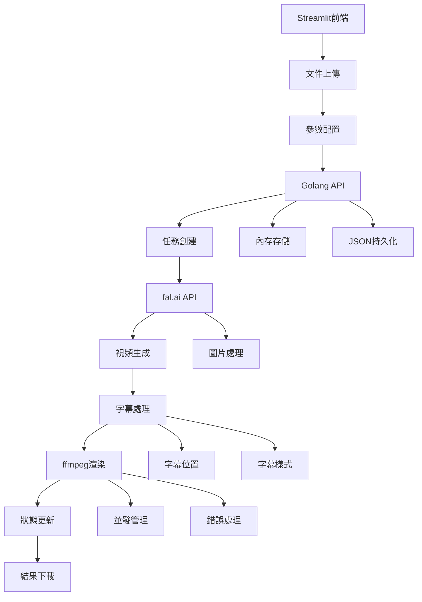

# genVideo&Sub 產品需求文檔

## 1. Product Overview
genVideo&Sub 是一個輕量化的AI視頻生成服務，採用Streamlit前端和Golang後端架構，專門整合fal.ai API進行視頻生成。
該服務主要解決需要批量處理視頻生成任務的需求，提供簡潔的Web界面和高效的後端處理能力。
目標是提供零依賴、易部署的AI視頻生成解決方案，支援大文件異步處理和批量任務管理。

## 2. Core Features

### 2.1 系統架構
本專案採用輕量化設計，無需複雜的用戶管理，主要提供以下核心功能：
- 任務管理：創建、查詢、管理視頻生成任務
- 文件處理：圖片下載、臨時存儲、文件清理
- AI集成：fal.ai API調用、異步處理、結果回調
- 前端界面：Streamlit測試界面、批量上傳、進度顯示

### 2.2 Feature Module
我們的 genVideo&Sub 服務包含以下主要功能：
1. **Streamlit前端**：多文件選擇、批量上傳、實時狀態顯示
2. **Golang API服務**：RESTful API、任務隊列、並發處理
3. **fal.ai集成**：AI視頻生成、參數配置、結果處理
4. **字幕處理**：ffmpeg字幕添加、位置選擇、文字自定義
5. **存儲管理**：內存存儲、JSON持久化、臨時文件管理

### 2.3 Module Details
| Module Name | Component | Feature description |
|-------------|-----------|---------------------|
| Streamlit前端 | 文件上傳器 | 多文件選擇、拖拽上傳、文件預覽 |
| Streamlit前端 | 參數配置器 | 視頻生成參數、字幕內容、位置、樣式設定 |
| 字幕處理 | 字幕渲染器 | 使用ffmpeg添加文字字幕到視頻 |
| 字幕處理 | 位置管理器 | 支援上、中、下三種字幕位置選擇 |
| 字幕處理 | 樣式配置器 | 字幕字體、顏色、大小、背景設定 |
| Streamlit前端 | 狀態顯示器 | 實時任務狀態、進度條、結果展示 |
| Golang API | 任務管理器 | 創建任務、狀態查詢、任務列表 |
| Golang API | HTTP路由器 | RESTful API、請求處理、響應格式化 |
| Golang API | 並發處理器 | Goroutine Pool、Channel隊列、工作分配 |
| fal.ai集成 | API客戶端 | HTTP請求、認證管理、錯誤處理 |
| fal.ai集成 | 異步處理器 | 任務提交、狀態輪詢、結果獲取 |
| fal.ai集成 | 重試機制 | 指數退避、失敗重試、超時處理 |
| 存儲管理 | 內存存儲 | 任務狀態、臨時數據、快速訪問 |
| 存儲管理 | JSON持久化 | 數據備份、恢復機制、定期保存 |
| 存儲管理 | 文件清理器 | 臨時文件清理、過期檢查、空間管理 |

## 3. Core Process
**模組調用流程：**
用戶通過Streamlit界面使用genVideo&Sub服務的主要操作流程如下：

**視頻生成流程**：
1. 用戶在Streamlit界面選擇圖片文件
2. 配置視頻生成參數和字幕設定（內容、位置、樣式）
3. 提交任務到Golang後端API
4. 系統創建任務並調用fal.ai API生成原始視頻
5. 視頻生成完成後，使用ffmpeg添加字幕
6. 異步處理並實時顯示任務狀態
7. 完成後提供帶字幕的視頻下載連結

**批量處理流程**：
1. 用戶選擇多個圖片文件進行批量上傳
2. 系統創建多個並發任務
3. Goroutine Pool管理並發處理
4. 實時更新每個任務的處理狀態
5. 完成後批量下載所有生成的視頻

## 4. Design Specifications

### 4.1 Design Style
本專案採用Streamlit原生設計風格，簡潔易用：
- 主色調：Streamlit預設藍色 (#FF6B6B)，輔助色：淺灰色 (#F8F9FA)
- 按鈕樣式：Streamlit原生按鈕，圓角設計
- 字體：系統預設字體，標題使用st.title，內容使用st.text
- 佈局風格：側邊欄配置，主區域顯示，響應式設計
- 組件風格：使用st.file_uploader、st.selectbox、st.progress等原生組件
- 字幕預覽：實時預覽字幕效果，支援位置和樣式調整

### 4.2 字幕功能設計

#### 4.2.1 字幕位置選項
| 位置 | 描述 | ffmpeg參數 |
|------|------|------------|
| 上方 | 字幕顯示在視頻上方區域 | drawtext=y=h*0.1 |
| 中央 | 字幕顯示在視頻中央區域 | drawtext=y=(h-text_h)/2 |
| 下方 | 字幕顯示在視頻下方區域 | drawtext=y=h*0.9-text_h |

#### 4.2.2 字幕樣式配置
| 參數 | 選項 | 預設值 |
|------|------|--------|
| 字體大小 | 16-72px | 24px |
| 字體顏色 | 白色、黑色、紅色、藍色、自定義 | 白色 |
| 背景色 | 透明、黑色半透明、白色半透明 | 黑色半透明 |
| 字體樣式 | 粗體、斜體、正常 | 正常 |

#### 4.2.3 用戶界面設計
| 組件 | 功能 | 實現方式 |
|------|------|----------|
| 字幕內容輸入 | 用戶輸入字幕文字 | st.text_area |
| 位置選擇器 | 選擇字幕位置 | st.selectbox |
| 樣式配置面板 | 字體、顏色、大小設定 | st.sidebar組件群 |
| 預覽區域 | 顯示字幕效果預覽 | st.image with overlay |